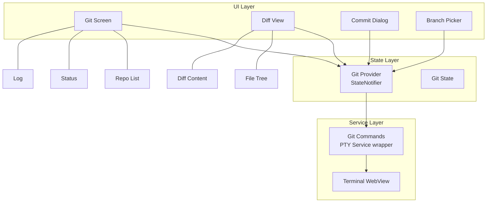

# Git Integration Plan for VELOX Mobile IDE

## Overview

Add Git version control functionality to VELOX for managing repositories directly from the mobile IDE.

## Architecture



## File Structure

```
lib/features/git/
├── git_provider.dart      # State management (StateNotifier)
├── git_screen.dart         # Main UI
├── git_models.dart         # Data classes (GitCommit, GitFileStatus)
├── git_commands.dart       # Git command execution via PTY
└── diff_view.dart          # Diff visualization widget

lib/core/router/
└── app_router.dart         # Add /git route

assets/
└── diff/                   # Diff icons (+, -, ~)
```

## Implementation Steps

### Step 1: Git Models (`git_models.dart`)

```dart
enum FileStatus { modified, added, deleted, renamed, untracked }

class GitFileStatus {
  final String path;
  final FileStatus status;
  final bool isStaged;
}

class GitCommit {
  final String hash;
  final String shortHash;
  final String message;
  final String author;
  final DateTime timestamp;
}

class GitBranch {
  final String name;
  final bool isCurrent;
  final bool isRemote;
}

class GitState {
  final String? repoPath;
  final String? repoName;
  final List<GitFileStatus> files;
  final List<GitCommit> commits;
  final List<GitBranch> branches;
  final String? currentBranch;
  final bool isLoading;
  final String? error;
}
```

### Step 2: Git Commands Service (`git_commands.dart`)

```dart
class GitCommands {
  final PtyService _pty;
  
  GitCommands(this._pty);
  
  Future<String> status(String repoPath);
  Future<String> log(String repoPath, {int limit = 50});
  Future<String> diff(String repoPath, {String? ref});
  Future<String> diffCached(String repoPath);
  Future<void> commit(String repoPath, String message);
  Future<void> push(String repoPath);
  Future<void> pull(String repoPath);
  Future<String> clone(String url, String destPath);
  Future<List<GitBranch>> branches(String repoPath);
  Future<void> checkout(String repoPath, String branch);
  Future<void> add(String repoPath, String file);
  Future<void> reset(String repoPath, String file);
  Future<String> remote(String repoPath);
}
```

### Step 3: Git Provider (`git_provider.dart`)

```dart
class GitNotifier extends StateNotifier<GitState> {
  final GitCommands _commands;
  
  GitNotifier(this._commands) : super(const GitState());
  
  // Open repository
  Future<void> openRepo(String path);
  
  // Refresh status
  Future<void> refreshStatus();
  
  // Stage file
  Future<void> stageFile(String path);
  
  // Unstage file
  Future<void> unstageFile(String path);
  
  // Commit
  Future<bool> commit(String message);
  
  // Push/Pull
  Future<void> push();
  Future<void> pull();
  
  // Clone
  Future<void> cloneRepo(String url);
  
  // Branch operations
  Future<void> switchBranch(String branch);
  Future<List<GitBranch>> fetchBranches();
}

final gitProvider = StateNotifierProvider<GitNotifier, GitState>(
  (ref) => GitNotifier(ref.watch(ptyServiceProvider)),
);
```

### Step 4: Git Screen UI (`git_screen.dart`)

**Layout:**
```
┌─────────────────────────────────────┐
│ Header: Repo Name + Branch Dropdown │
├─────────────────────────────────────┤
│ ┌─────────────────────────────────┐ │
│ │ Tab Bar: Files | Log | Branches │ │
│ ├─────────────────────────────────┤ │
│ │                                 │ │
│ │ Content Area                    │ │
│ │ (根据Tab显示不同内容)             │ │
│ │                                 │ │
│ └─────────────────────────────────┘ │
├─────────────────────────────────────┤
│ Actions: Pull | Push | Commit      │
└─────────────────────────────────────┘
```

**Tab 1 - Files:**
- List of modified files with status icons
- Long press to stage/unstage
- Tap to view diff

**Tab 2 - Log:**
- Commit history list
- Each item: hash, message, author, time
- Tap to view commit details

**Tab 3 - Branches:**
- Current branch highlighted
- List of local/remote branches
- Switch branch action

### Step 5: Diff View (`diff_view.dart`)

- Unified or side-by-side diff view
- Syntax highlighting
- Line numbers
- Navigate between changes

### Step 6: Router Integration

```dart
// lib/core/router/app_router.dart
GoRoute(
  path: '/git',
  builder: (_, __) => const GitScreen(),
),
```

Add to bottom navigation:
```dart
NavigationDestination(
  icon: Icon(Icons.merge_type_outlined),
  selectedIcon: Icon(Icons.merge_type),
  label: 'Git',
),
```

## Dependencies

No new packages required - uses existing:
- `flutter_riverpod` for state management
- `file_picker` for folder selection
- `pty_service` (existing) for command execution

## API Commands

Git commands used:
```bash
git status --porcelain
git log --oneline -n 50
git diff [--cached] [file]
git add <file>
git reset HEAD <file>
git commit -m "<message>"
git push
git pull
git clone <url>
git branch -a
git checkout <branch>
git remote -v
```

## Error Handling

- No git installed → Show installation guide
- Not a git repo → Prompt to clone or init
- Push rejected (non-fast-forward) → Offer pull --rebase
- Authentication failed → Prompt for credentials

## Future Enhancements (out of scope for MVP)

- [ ] Interactive rebase
- [ ] Stash management
- [ ] Submodules support
- [ ] Git config (user.name, user.email)
- [ ] Diff between arbitrary commits
- [ ] Create/merge pull requests (GitHub/GitLab API)